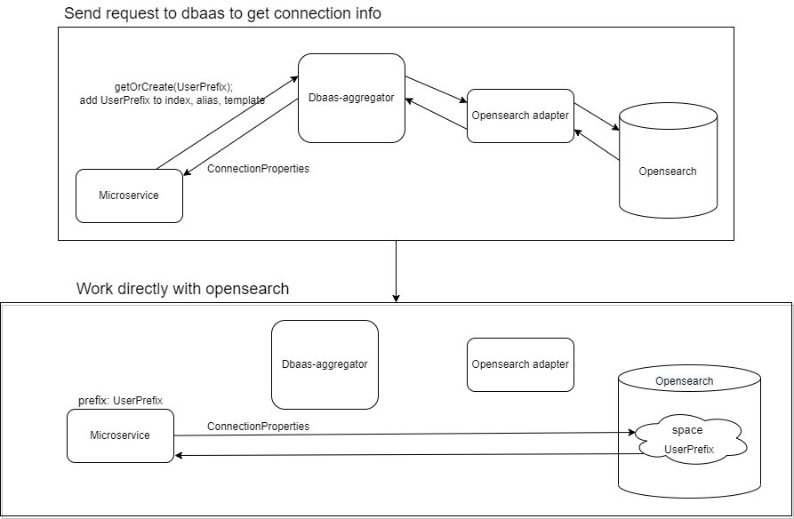

[](https://sonarcloud.io/summary/overall?id=Netcracker_qubership-core-lib-go-dbaas-opensearch-client)
[](https://sonarcloud.io/summary/overall?id=Netcracker_qubership-core-lib-go-dbaas-opensearch-client)
[](https://sonarcloud.io/summary/overall?id=Netcracker_qubership-core-lib-go-dbaas-opensearch-client)
[](https://sonarcloud.io/summary/overall?id=Netcracker_qubership-core-lib-go-dbaas-opensearch-client)
[](https://sonarcloud.io/summary/overall?id=Netcracker_qubership-core-lib-go-dbaas-opensearch-client)

# Go-opensearch dbaas client

This module provides convenient way of interaction with **opensearch** objects (indices, aliases, templates, etc) provided by dbaas-aggregator.
`Opensearch dbaas go client` supports _multi-tenancy_ and can work with both _service_ and _tenant_ databases.  

- [Overview](#overview)
- [Install](#install)
- [Usage](#usage)
    * [Get connection for existing database or create new one](#get-connection-for-existing-database-or-create-new-one)
    * [Find connection for existing database](#find-connection-for-existing-database)
    * [OpensearchClient](#opensearchclient)
- [Classifier](#classifier)
- [Restrictions](#restrictions)
- [SSL/TLS support](#ssltls-support)
- [Quick example](#quick-example)

## Overview

Since opensearch does not support objects (indices, templates and aliases) isolation we had to create it artificially.
This was done by introducing a unique prefix for any opensearch user. Each user's object will have the same prefix.
Each user can access only objects with its prefix.

New user wil be created for each service database and for each tenant database. You don't have to create user by
yourself - user wil be created automatically with first request.

The next diagram shows how microservice interact with dbaas-aggregator and opensearch.  


User *must* add prefix by themselves. Please take a look on section
[Restrictions](#restrictions).

## Install


To get `opensearch dbaas client` use
```go
 go get github.com/netcracker/qubership-core-lib-go-dbaas-opensearch-client@<latest released version>
```

List of all released versions may be found [here](https://github.com/netcracker/qubership-core-lib-go-dbaas-opensearch-client/-/tags)

## Usage

At first user should create `DbaaSOpensearchClient`. This is a base client, which allows working with tenant and service databases.
To create instance of `DbaaSOpensearchClient` use `NewClient(pool *dbaasbase.DbaaSPool) *DbaaSOpensearchClient`.

Note that client has parameter _pool_. `dbaasbase.DbaaSPool` is a tool which stores all cached connections and
create new ones. To find more info visit [dbaasbase](https://github.com/netcracker/qubership-core-lib-go-dbaas-base-client/blob/main/README.md)

Example of client creation:
```go
pool := dbaasbase.NewDbaasPool()
client := osdbaas.NewClient(pool)
```

By default, Opensearch dbaas go client supports dbaas-aggregator as databases source. But there is a possibility for user to provide another
sources (for example, zookeeper). To do so use [LogcalDbProvider](https://github.com/netcracker/qubership-core-lib-go-dbaas-base-client/blob/main/README.md#logicaldbproviders)
from dbaasbase.

Next step is to create `Database` object. `Databse` is not a opensearch.Client instance. It just an interface which allows
creating osClient or getting connection properties from dbaas. At this step user may choose which type of database he will
work with: `service` or `tenant`.

* To work with service databases use `ServiceDatabase(params ...model.DbParams) Database`
* To work with tenant databases use `TenantDatabase(params ...model.DbParams) Database`

Each func has `DbParams` as parameter.

DbParams store information for database creation. Note that this parameter is optional, but if user doesn't pass Classifier,
default one will be used. More about classifiers [here](#classifier)

| Name         | Description                                                                                                            | type                                                                                                                     |
|--------------|------------------------------------------------------------------------------------------------------------------------|--------------------------------------------------------------------------------------------------------------------------|
| Classifier   | function which builds classifier from context. Classifier should be unique for each opensearch db.                     | func(ctx context.Context) map[string]interface{}                                                                         |
| BaseDbParams | Specific parameters for database creation or getting connection.                                                       | [BaseDbParams](https://github.com/netcracker/qubership-core-lib-go-dbaas-base-client/blob/main#basedbparams) |                                                  |
| Delimiter    | Parameters which defines delimiter between prefix and name. Full name = <prefix><delimiter><name> . Default value = "_" | string                                                                                                                   |

Example how to create an instance of Database.
```go
 dbPool := dbaasbase.NewDbaasPool()
 client := osdbaas.NewClient(dbPool)
 serviceDB := client.ServiceDatabase() // service Database creation 
 tenantDB := client.TenantDatabase() // tenant client creation 
```

`Database` allows: create new opensearch index and get connection to it, get connection to existing database and create osClient. `serviceDB` and `tenantDB`
should be `singleton and it's enough to create them only once`.

### Get connection for existing database or create new one

Func `GetConnectionProperties(ctx context.Context) (*model.OpensearchConnProperties, error)`
at first will check if the desired database with _opensearch_ type and classifier exists. If it exists, function will just return
connection properties in the form of [OpensearchConnProperties](model/opensearch_conn_properties.go).
If database with _opensearch_ type and classifier doesn't exist, such database will be created and function will return
connection properties for a new created database.

_Parameters:_
* ctx - context, enriched with some headers (See docs about context-propagation [here](https://github.com/netcracker/qubership-core-lib-go/blob/main/context-propagation/README.md)). Context object can have request scope values from which can be used to build classifier, for example tenantId.

```go
    ctx := ctxmanager.InitContext(context.Background(), propagateHeaders()) // preferred way
    // ctx := context.Background() // also possible for service client, but not recommended
    osConnProperties, err := database.GetConnectionProperties(ctx)
```

### Find connection for existing database

Func `FindConnectionProperties(ctx context.Context) (*model.OpensearchConnProperties, error)`
returns connection properties in the form of [OpensearchConnProperties](model/opensearch_conn_properties.go). Unlike `GetConnectionProperties`
this function won't create database if it doesn't exist and just return nil value.

_Parameters:_
* ctx - context, enriched with some headers. (See docs about context-propagation [here](https://github.com/netcracker/qubership-core-lib-go/blob/main/context-propagation/README.md)). Context object can have request scope values from which can be used to build classifier, for example tenantId.

```go
    ctx := ctxmanager.InitContext(context.Background(), propagateHeaders()) // preferred way
    // ctx := context.Background() // also possible for service client, but not recommended
    osConnProperties, err := database.FindConnectionProperties(ctx)
```

### OpensearchClient

OpensearchClient is a special object, which allows getting `opensearchapi.Client` to establish connection and to operate with a opensearch cluster. 
`OpensearchClient` is a singleton and should be created only once.

OpensearchClient has method `GetClient(ctx context.Context) (*opensearchapi.Client, error)` which will return `*opensearchapi.Client` for executing queries.
We recommend getting `opensearchapi.Client` before each query for receiving fresh connection and checking 
a password validity. If necessary, the password will be updated.

Note that: classifier will be created with context and function from DbParams.

To create osClient use `GetOpensearchClient(config ...*opensearch.Config) (osdbaas.OpensearchClient, error)`

Parameters:
* config *opensearch.Config _optional_ - user may pass desired opensearch.Config or don't pass anything at all. Note that user doesn't have to
  set connection parameters (such as url, user and password) with options, because these parameters will be received from dbaas-aggregator.

```go
    ctx := ctxmanager.InitContext(context.Background(), propagateHeaders()) // preferred way
    // ctx := context.Background() // also possible for service client, but not recommended
    config := &opensearch.Config{
      DisableRetry: true,
      EnableMetrics: true,
    }
    osClient, err := database.GetOpensearchClient(config) // with config
```

## Classifier

Classifier and dbType should be unique combination for each database.  Fields "tenantId" or "scope" must be into users' custom classifiers.

User can use default service or tenant classifier. It will be used if user doesn't specify Classifier in DbParams. This is recommended approach and we don't recommend using custom classifier
because it can lead to some problems. Use can be reasonable if you migrate to this module and before used custom and not default classifier.

Default service classifier looks like:
```json
{
    "scope": "service",
    "microserviceName": "<ms-name>",
    "namespace" : "<ms-namespace>"
}
```

Default tenant classifier looks like:
```json
{
  "scope": "tenant",
  "tenantId": "<tenant-external-id>",
  "microserviceName": "<ms-name>",
  "namespace" : "<ms-namespace>"
}
```
Note, that if user doesn't set `MICROSERVICE_NAME` (or `microservice.name`) property, there will be panic during default classifier creation.
Also, if there are no tenantId in tenantContext, **panic will be thrown**.

## Restrictions

This library contains several restriction.
1) we don't support cluster operations, tasks, data streams 
and pipelines because their management doesn't fit into dbaas philosophy.

2) All requests operating with indices, templates or aliases via client must be modified with `Normalize(ctx, target_name)` method.
*`Normalize(ctx, target_name)` call before each query*
This method adds prefix with delimiter to `target_name` and returns full name with prefix. If you pass full name to normalize then function returns full name.

Prefix and delimiter can be set in model.DbParams{} before creating service or tenant database.

### Example with custom delimiter and prefix
#### Service Database
```go
  dbPool := dbaasbase.NewDbaaSPool()
  osDbClient := osdbaas.NewClient(dbPool)
  params := model.DbParams{}
  params.BaseDbParams.NamePrefix = "somePrefix"
  delimiter := "_"
  params.Delimiter = &delimiter 
  db := osDbClient.ServiceDatabase(params)
  client, _ := db.GetOpensearchClient() 
  
  IndexName := "index-name"
  normalizeIndexName, err := client.Normalize(ctx, IndexName)//somePrefix_index-name
```

#### Tenant Database
In tenant database prefix 'tenantId' value put into prefix instead of '{tenantId}' 
```go
  dbPool := dbaasbase.NewDbaaSPool()
  osDbClient := osdbaas.NewClient(dbPool)
  params := model.DbParams{}
  params.BaseDbParams.NamePrefix = "some-{tenantId}-prefix"
  delimiter := "--"
  params.Delimiter = &delimiter
  db := osDbClient.TenantDatabase(params)//For example, ctx contains Tenant value == '12345' 
  client, _ := db.GetOpensearchClient() 
  
  IndexName := "index-name"
  normalizeIndexName, err := client.Normalize(ctx, IndexName)//some-12345-prefix--index-name
```

## SSL/TLS support

This library supports work with secured connections to opensearch. Connection will be secured if TLS mode is enabled in
opensearch-adapter.

For correct work with secured connections, the library requires having a truststore with certificate.
It may be public cloud certificate, cert-manager's certificate or any type of certificates related to database.
We do not recommend use self-signed certificates. Instead, use default NC-CA.

To start using TLS feature user has to enable it on the physical database (adapter's) side and add certificate to service truststore.

### Physical database switching

To enable TLS support in physical database redeploy opensearch with mandatory parameters
```yaml
global.tls.enabled=true;
opensearch.tls.enabled=true;
dbaasAdapter.tls.enabled=true;
```

In case of using cert-manager as certificates source add extra parameters
```yaml
global.tls.generateCerts.clusterIssuerName=<cluster issuer name>;
```

ClusterIssuerName identifies which Certificate Authority cert-manager will use to issue a certificate.
It can be obtained from the person in charge of the cert-manager on the environment.

## Quick example

Here we create opensearch tenant client, then get osClient and execute a query for index creation with document insertion.

application.yaml
```yaml
application.yaml
  
  microservice.name=tenant-manager
```

```go
package main

import (
  "context"
  "github.com/netcracker/qubership-core-lib-go/v3/configloader"
  "github.com/netcracker/qubership-core-lib-go/v3/context-propagation/ctxmanager"
  "github.com/netcracker/qubership-core-lib-go/v3/logging"
  dbaasbase "github.com/netcracker/qubership-core-lib-go-dbaas-base-client/v3"
  "github.com/netcracker/qubership-core-lib-go-dbaas-base-client/v3/model/rest"
  osdbaas "github.com/netcracker/qubership-core-lib-go-dbaas-opensearch-client/v5"
  osapi "github.com/netcracker/qubership-core-lib-go-dbaas-opensearch-client/v5/api"
  "github.com/opensearch-project/opensearch-go/v3/opensearchapi"
  "strings"
)

var logger logging.Logger

func init() {
  configloader.Init(configloader.BasePropertySources())
  logger = logging.GetLogger("main")
  ctxmanager.Register([]ctxmanager.ContextProvider{tenantcontext.TenantProvider{}})
}

func main() {
  // some context initialization 
  ctx := ctxmanager.InitContext(context.Background(), map[string]interface{}{tenant.TenantContextName: "id"})

  dbPool := dbaasbase.NewDbaaSPool()
  osDbClient := osdbaas.NewClient(dbPool)
  db := osDbClient.TenantDatabase()
  client, _ := db.GetOpensearchClient() // singleton for tenant db. This object must be used to get connection in the entire application.
  
  document := strings.NewReader(`{
        "title": "Moneyball",
        "director": "Bennett Miller",
        "year": 2011
    }`)

  normalizeIndexName, err := client.Normalize(ctx, "sample-index") //USE BEFORE EVERY REQUEST
  if(err != nil){
	  return err
  }
  req := opensearchapi.DocumentCreateReq{
	  Index:      indexName,
	  DocumentID: docId,
	  Body:       document,
  }
  osclient, _ := client.GetClient(suite.ctx)
  createResponse, err := osclient.Document.Create(suite.ctx, req)
  logger.Infof("Creation response: %+v", createResponse)

}

```
